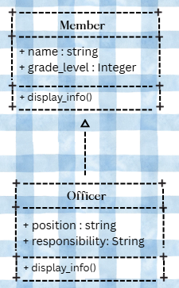
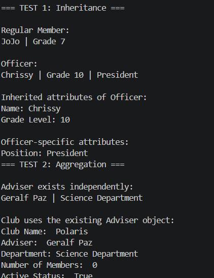
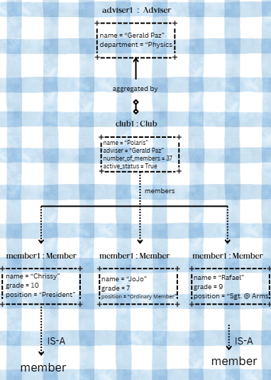

# Advanced Class Relationships

## Previous Activities
[classAttrib](classAttributesMethods.md)
[classRel](classRelationships.md)

## Existing System Description:
The existing system contains the Club and Member class, wherein a club can contain multiple member objects through a one-to-many association.
One limitation of the previous design is that the member class still stores a role even if the member object is not an officer. And the club class also stores adviser as a text rather than being an actual object.
## Inheritance Relationship
Parent: Member

Child: Officer

Explanation:
An officer is a type of Member because every officer is also a member. Both of these have a name, and grade level assigned to them, but officer has an added position.

## Inheritance UML

## Composition/Aggregation
Relationship: Aggregation

Explanation: The club aggregates an Adviser because the advise can exist independently, so removing the club does not require removing the adviser.

## Advanced UML Diagram

## Python Implementation
[Source Code](advancedRelationships.py)

## Test Run

## Object Diagram

## Reflection
Answers:
1. Why did you choose your inheritance relationship Explain why your child class is a type of your parent class.

I chose Officer IS-A Member because every club officer is also a member of the club, while sharing general information between them, but the officer has an addition of a position and responsibilities.

2. How did inheritance reduce duplicate code? Identify attributes or methods that were reused.

Inheritance reduces duplicate code because, there is no need to redefine attributes such as the grade level, and name all over again. These values are initialized by Member using super().__init__(), which allows shared code to remain in one parent class.

3. Why is your HAS-A relationship Composition or Aggregation? Explain the lifecycle relationship
between the two objects.

The Club HAS-AN adviser relationship is aggregation because the Adviser can exist outside the Club, The adviser is created before being assigned to the club, meaning if the club stops existing, the adviser can still exist independently.

4. What is the difference between Association from Part III and the advanced relationship you
implemented?

The club and member relationship in part III is an association that shows that the two objects are connected. While the relationship here shows that the Adviser is an independent object from the Club, meaning it can exist on its own.

5. How does your design follow the DRY principle?

The system follows the DRY principle because shared Member features are defined only one, and officer inherits attributes and methods rather than repeating them, reducing duplicated code.