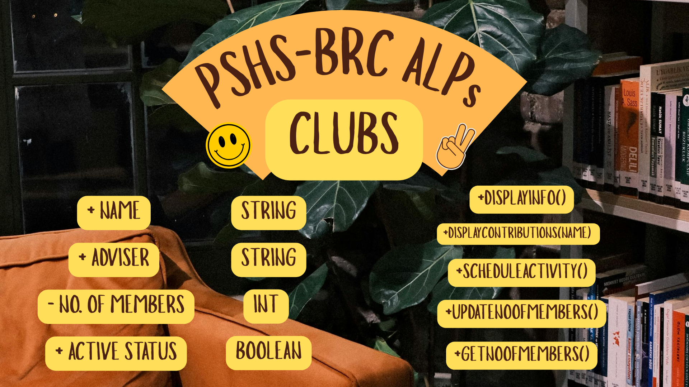
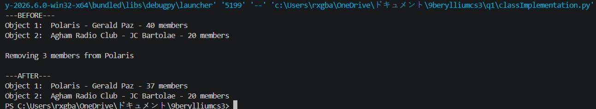

# Class Attributes and Methods

## Previous Design
Link to my previous activity:
[classObjectUML.md](classObjectUML.md)

## Design Revision
The major changes I did was adding the methods, updatemembers, and getmembers, and adding the attribute's visibility

## Visibility Decisions
| Attribute | Data Type | Visibility | Reason |
|---|---|---|---|
|Name |String |public |The club's name is a general attribute of the respective ALPs which can be displayed freely |
|Name of adviser |String |public |The club adviser is a general attribute of the respective ALPs which can be displayed freely |
|Number of Members|Integer |private |The number of members a club has needs to be protected so that it will not accidentally get changed to an invalid numbers such as a negative number |
|Active Status |Boolean |public |The active status is general information that members/ aspiring members may need to check |

## Updated UML Class Diagram

## Python Implementation
[View Python Source](classImplementation.py)

## Test Run

## Object Diagram

## Analysis
### Why did you make your chosen attribute private?

### Which method changes the state of your object?

### How did your two objects demonstrate that instances are independent?

### What is the difference between your class diagram and your object diagram?
