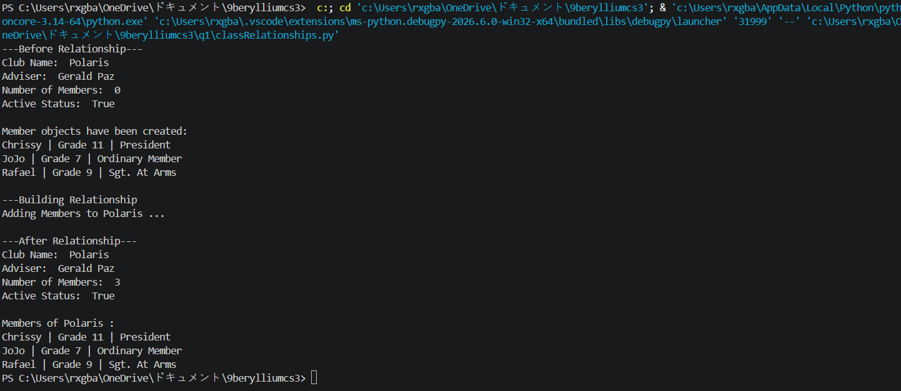

# Class Relationships: Association and Multiplicity
## Previous Work
[Part I - Classes and Objects](classObjectUML.md)
[Part II - Class Attributes and Methods](classAttributesMethods.md)

## Existing Class
Class: Club
Description: Represents an ALP Club. Stores values such as name, adviser, number of members, and active status.

## New Related Class
Class: Member
Description: Represents a student that belongs to a club. Stores information such as name, grade level, and role in the club.

## Association
Relationship: Club has Members
Explanation: A club is associated with Members because it can contain, and manage multiple student members, with each member object representing an actual member of a specific club.

## Multiplicity
Multiplicity: 1 : 
Explanation: The multiplicity is 1 to 0..*  because 1 club can hold and manage zero or more members. This can be seen in a newly established club with zero members, and an old club with many members.

## UML Class Relationship Diagram

## Python Implementation
[View Python Source](classRelationships.py)

## Test Run

## Object Relationship Diagram

## Analysis
### What is the association between your two classes?

### What multiplicity did you choose and why?

### How did you implement the relationship in Python?

### Why did you store an object reference instead of copying its data?

### If your relationship uses many, why is a list appropriate?
