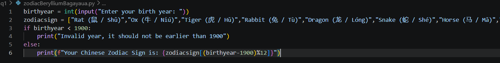
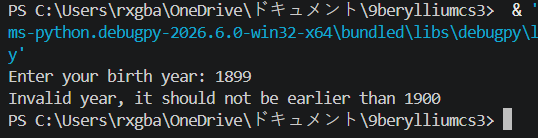
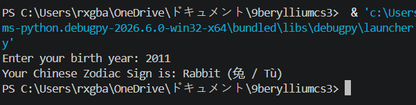

# Chinese Zodiac Instructions

    *a*. Ask the user to enter a year of birth.  The baseline year 1900.
    *b*. Validate user input that it should not be earlier than 1900.
    *c*. If the user enters an invalid year then display an appropriate message then stop or abort the program.
    *d*. Otherwise determine the chinese zodiac sign based on the following starting from 1900.  Note: A zodiac sign will recur after each 12 years.

    i. Rat (鼠 / Shǔ)
    ii. Ox (牛 / Niú)
    iii. Tiger (虎 / Hǔ)
    iv. Rabbit (兔 / Tù)
    v. Dragon (龙 / Lóng)
    vi. Snake (蛇 / Shé)
    vii. Horse (马 / Mǎ)
    viii. Goat (羊 / Yáng)
    ix. Monkey (猴 / Hóu)
    x. Rooster (鸡 / Jī)
    xi. Dog (狗 / Gǒu)
    xii. Pig (猪 / Zhū)

    *e*. **CONSIDER** only the year of birth.

Example input and output:
Enter your birth year: 2000
Your Chinese Zodiac Sign is: Dragon (龙 / Lóng)

Test and Run your code before submitting.

Document this graded exercise in your Github portfolio and save it in zodiacSectionLN.md. This .md will include the requirements for this coding exercise, your actual code and a screenshot of your output. Update also your README.md file to have the link to your files.

# Actual Code

## Invalid Test Run - Picture

## Valid Test Run - Picture

